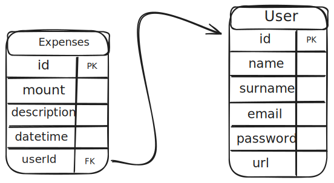

# FTracker

FTracker is an API oriented towards personal finance management that allows you to keep a record of monthly expenses and perform a balance check.

## Database

## Stack

| NestJS  |
| :-----: |
| TypeORM |
|  MySQL  |
| Swagger |
|   JWT   |
|  Jest   |

